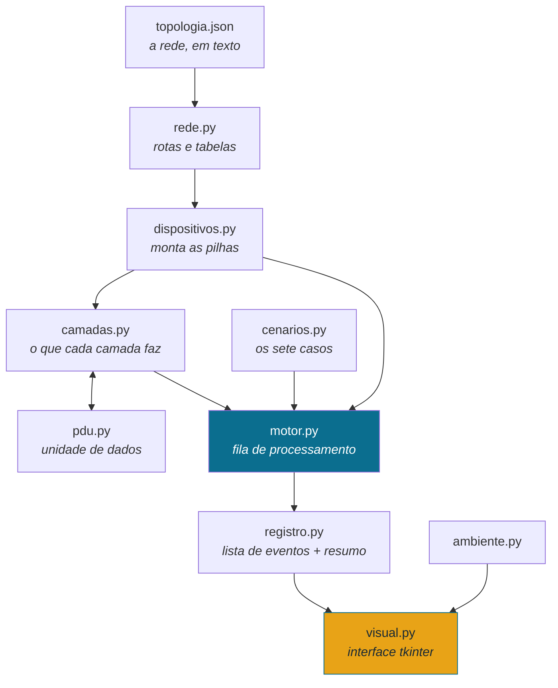

# Documentação técnica — Simulador Visual do Modelo OSI

> **Disciplina:** COMUNICAÇÃO DE DADOS
>
> Este documento é para quem vai ler, corrigir ou continuar o código. O guia de
> instalação está em `tutorial_execucao.md` e o guia da interface em
> `tutorial_uso.md`.

## Sumário

1. [Objetivo e escopo](#1-objetivo-e-escopo)
2. [Visão geral da arquitetura](#2-visão-geral-da-arquitetura)
3. [Módulos](#3-módulos)
4. [Convenções de simulação](#4-convenções-de-simulação)
5. [O arquivo de topologia](#5-o-arquivo-de-topologia)
6. [O que cada camada faz](#6-o-que-cada-camada-faz)
7. [Como as restrições do enunciado foram garantidas](#7-como-as-restrições-do-enunciado-foram-garantidas)
8. [Formato do registro](#8-formato-do-registro)
9. [Cálculo da eficiência](#9-cálculo-da-eficiência)
10. [Os sete casos de demonstração](#10-os-sete-casos-de-demonstração)
11. [A interface gráfica](#11-a-interface-gráfica)
12. [Estratégia de testes](#12-estratégia-de-testes)
13. [Limitações e simplificações](#13-limitações-e-simplificações)
14. [Como estender o simulador](#14-como-estender-o-simulador)

---

## 1. Objetivo e escopo

O simulador mostra o que acontece com uma mensagem entre o momento em que um
processo a gera e o momento em que outro processo a recebe, em uma rede com
roteadores no caminho. O foco é o **empilhamento e o desempilhamento de
cabeçalhos** e a diferença de comportamento entre um computador (sete camadas)
e um roteador (três camadas).

Está no escopo: encapsulamento, decisão de rota por menor custo, reconstrução do
quadro a cada enlace, segmentação e remontagem, multiplexação por portas,
detecção de erro por verificação, descarte, e o cálculo do custo do
empilhamento.

Não está no escopo: temporização real, controle de fluxo, retransmissão,
protocolos reais (TCP, IP, Ethernet e ARP aparecem apenas como inspiração dos
nomes e dos tamanhos), e criptografia de verdade.

---

## 2. Visão geral da arquitetura

A decisão estruturante do projeto é a separação entre **um núcleo determinístico
sem interface** e **uma camada de apresentação que só desenha**.



A simulação inteira acontece **antes** de qualquer desenho. Ao pressionar
*Simular*, o motor percorre a rede do começo ao fim e devolve uma lista imutável
de eventos. A interface é um leitor dessa lista: avançar um passo é incrementar
um índice, e voltar ao início é zerá-lo. Nada é recalculado durante a animação.

Três consequências práticas dessa escolha:

- **Testabilidade.** Os 91 testes automatizados nunca abrem uma janela. Eles
  chamam `executar_cenario()` e verificam a lista de eventos.
- **Determinismo.** A mesma entrada produz sempre a mesma lista de eventos, o
  que permite comparar o registro com o exemplo do enunciado linha por linha.
- **Independência da biblioteca gráfica.** Trocar `tkinter` por outra biblioteca
  exigiria reescrever apenas `visual.py`.

---

## 3. Módulos

| Módulo | Depende de | Papel |
|---|---|---|
| `pdu.py` | — | A unidade de dados e as regras de acesso a ela. |
| `rede.py` | — | Topologia, menor custo, tabelas de encaminhamento, falhas. |
| `camadas.py` | `pdu` | O comportamento de cada uma das sete camadas. |
| `dispositivos.py` | `camadas`, `rede` | Computador (7 camadas) e roteador (3 camadas). |
| `cenarios.py` | — | Declaração dos sete casos e dos valores esperados. |
| `motor.py` | todos os acima | Executa a simulação e gera os eventos. |
| `registro.py` | — | Formata o registro e calcula a eficiência. |
| `ambiente.py` | — | Localiza arquivos no código-fonte e dentro do executável. |
| `visual.py` | `motor`, `registro`, `rede` | Interface gráfica. |

Não há dependência circular: o grafo acima é acíclico e `visual.py` é folha.

---

## 4. Convenções de simulação

Esta seção declara todas as escolhas que o enunciado deixou em aberto ou que
foram necessárias para reproduzir os valores publicados. **Alterar qualquer
número desta seção altera os resultados numéricos do simulador.**

### 4.1 Tamanhos fixos

| Elemento | Tamanho | Origem |
|---|---:|---|
| Cabeçalho da camada 5 (sessão) | 4 octetos | enunciado |
| Cabeçalho da camada 4 (transporte) | 8 octetos | enunciado |
| Cabeçalho da camada 3 (rede) | 20 octetos | enunciado |
| Cabeçalho da camada 2 (enlace) | 14 octetos | enunciado |
| Finalizador da camada 2 | 4 octetos | enunciado |

As camadas 7, 6 e 1 não acrescentam octetos. A camada 6 cifra o conteúdo, e a
cifra escolhida preserva o tamanho justamente para não interferir na contagem.

Uma mensagem de 42 octetos chega ao meio físico com 92 octetos:
`42 + 4 + 8 + 20 + 14 + 4 = 92`.

### 4.2 Segmentação: dois parâmetros, não um

Os documentos do projeto pedem duas coisas que um único limite não atende ao
mesmo tempo:

- o caso da mensagem longa (100 octetos) deve produzir **três segmentos de 40,
  40 e 24 octetos de carga**, o que sugere um limite de 40;
- o caso central (42 octetos) deve produzir **eficiência de 11,4%**, o que exige
  **um único segmento** — e 42 octetos mais o cabeçalho de sessão somam 46, que
  seria dividido por um limite de 40.

A solução adotada separa o que costuma ser confundido em um só número:

```python
LIMITE_SEGMENTACAO = 48   # acima disto, a camada 4 segmenta
CARGA_POR_SEGMENTO = 40   # tamanho de cada segmento, quando há segmentação
```

Assim, 46 octetos passam inteiros (46 ≤ 48) e 104 octetos viram 40 + 40 + 24.
Ambos os valores publicados nos documentos são reproduzidos exatamente. Na vida
real, essa distinção existe: o limite de segmentação corresponde à unidade
máxima de transmissão e o tamanho do segmento, ao que o transmissor decide
enviar por vez.

O cabeçalho de sessão é contado dentro da carga do **primeiro** segmento, porque
ele foi inserido pela camada 5, que é anterior à segmentação. Por isso a divisão
de 104 octetos produz fatias de dados de 36, 40 e 24 (`36 + 4 = 40`).

### 4.3 Custos dos enlaces

| Enlace | Custo |
|---|---:|
| R1 – R4 | 1 |
| R3 – R4 | 1 |
| R1 – R2 | 2 |
| R2 – R3 | 1 |
| Redes locais (A, B, C) | 0 |

O enunciado não publica a tabela de custos, mas publica uma linha de registro
(`10.0.3.0/24 via R4, custo 2, interface e1`) e o resultado do desvio do caso de
falha (`custo total 3`). Os custos acima são o conjunto mais simples que produz
os dois valores ao mesmo tempo. Eles ficam em `topologia.json` e podem ser
editados.

### 4.4 Tabelas de encaminhamento

As tabelas **não são escritas à mão**: são calculadas a partir dos custos pelo
algoritmo de Dijkstra, sempre que consultadas. A escolha evita que a tabela e o
desenho da rede fiquem em desacordo quando alguém edita `topologia.json` ou
derruba um enlace na interface.

O desempate é determinístico: entre dois caminhos de mesmo custo, vence o que
tem o próximo salto de **nome menor em ordem alfabética**. Sem essa regra, a
mesma simulação poderia produzir registros diferentes em execuções diferentes.

### 4.5 Nomenclatura dos casos

O enunciado numera os casos de demonstração de C1 a C7 e os critérios de
avaliação numeram o mesmo conjunto de E1 a E7. São a mesma lista. O código usa
`C1..C7` internamente e a interface mostra os dois rótulos juntos (`E2/C2`),
para que não haja dúvida em nenhuma das duas leituras.

### 4.6 Endereçamento

- Endereço lógico: notação decimal com ponto e máscara em bits (`10.0.1.10/24`).
- Endereço físico: seis octetos em hexadecimal. Computadores começam com `AA`,
  roteadores com `BB`, e os dois últimos octetos identificam a rede e o
  dispositivo — `AA:00:00:00:01:0A` é o computador `0A` da rede `01`.
- No registro, o endereço físico aparece abreviado como `AA:...:01:0A`, exatamente
  como no exemplo do enunciado.

### 4.7 Resolução de endereço físico

O simulador não implementa ARP com requisição e resposta. A tradução de endereço
lógico para físico é consulta direta na topologia, **restrita ao segmento da
interface de saída**: um dispositivo só descobre o endereço físico de quem está
no mesmo enlace que ele. Essa restrição é o que faz o simulador se comportar
corretamente, e não a existência do protocolo.

### 4.8 Cifra da camada 6

XOR de cada octeto com a chave `0x5A`. Não tem valor criptográfico: serve para
tornar visível que o conteúdo transformado na camada 6 da origem só volta ao
original na camada 6 do destino, e não em nenhum roteador do caminho. A operação
preserva o tamanho, o que mantém as contagens do registro intactas.

### 4.9 Verificação de erro

O finalizador da camada 2 guarda um CRC-32 do quadro (`zlib.crc32`, da
biblioteca padrão). O receptor recalcula e compara. É o que permite ao caso do
erro de transmissão descartar o quadro **antes** de acionar a camada 3.

### 4.10 Numeração

- Quadros: `Q1`, `Q2`, … em ordem global de criação. Cada enlace cria o seu.
- Pacotes: `P1`, `P2`, … Um pacote atravessa a rede inteira e mantém o número.
- Sessões: `S-0001`, `S-0002`, … uma por fluxo.
- Passos do registro: começam em `001` e são contínuos dentro de uma simulação.

---

## 5. O arquivo de topologia

`topologia.json` descreve a rede por **segmentos**, não por pares de
dispositivos. Um segmento com duas interfaces é um enlace ponto a ponto; com
três ou mais, é uma rede local em que todos se enxergam diretamente — é o que
permite a entrega direta entre dois computadores sem passar por roteador.

```json
{
  "redes": [
    { "nome": "Rede A", "prefixo": "10.0.1.0/24", "custo": 0, "tipo": "local" },
    { "nome": "Enlace R1-R4", "prefixo": "10.0.14.0/24", "custo": 1, "tipo": "ponto-a-ponto" }
  ],
  "dispositivos": [
    {
      "nome": "H1",
      "tipo": "computador",
      "gateway": "10.0.1.1",
      "posicao": [0.05, 0.20],
      "interfaces": [
        { "nome": "eth0", "logico": "10.0.1.10", "mascara": 24,
          "fisico": "AA:00:00:00:01:0A", "rede": "Rede A" }
      ]
    }
  ]
}
```

`posicao` é um par de valores entre 0 e 1, relativo ao tamanho da área de
desenho. Um arquivo sem `posicao` ainda funciona: o simulador distribui os
dispositivos em círculo.

O carregamento valida, entre outras coisas: referências a redes inexistentes,
endereços lógicos ou físicos repetidos, gateway que não pertence a nenhuma
interface conhecida e redes sem nenhum membro. Qualquer problema levanta
`ErroDeTopologiaError` com uma mensagem que diz o que está errado e onde.

---

## 6. O que cada camada faz

Todas as camadas herdam de `Camada` e implementam `descer` e `subir`, que
devolvem um `Resultado` com as unidades produzidas e as ações a registrar.

| Camada | Na descida | Na subida |
|---|---|---|
| 7 Aplicação | `GERA` a mensagem a partir do texto e dos nomes dos processos | `ENTREGA` ao processo de destino |
| 6 Apresentação | `CODIFICA` em UTF-8 e cifra | `DECODIFICA` e decifra |
| 5 Sessão | `ABRE` a sessão e insere o cabeçalho de 4 octetos | `FECHA` a sessão |
| 4 Transporte | `SEGMENTA` e insere o cabeçalho com as portas | `DEMULTIPLEXA`, `AGUARDA` e `REMONTA` |
| 3 Rede | `ENCAPSULA` com os endereços lógicos e `ROTEIA` | `DESENCAPSULA` ou `DESCARTA` |
| 2 Enlace | `ENQUADRA` com os endereços físicos e o finalizador | `DESENQUADRA` ou `DESCARTA` |
| 1 Física | `TRANSMITE` os bits | `RECEBE` os bits |

Um roteador instancia apenas as camadas 3, 2 e 1. Não há objeto de camada 4 em
um roteador — a restrição é estrutural, não uma verificação em tempo de
execução.

---

## 7. Como as restrições do enunciado foram garantidas

O enunciado impõe cinco restrições de projeto. Em vez de confiar em disciplina
de programação, cada uma foi transformada em algo que o código impede ou que um
teste detecta.

**R1 — Um roteador não enxerga acima da camada 3.**
Duas barreiras. A primeira: `CAMADAS_ROTEADOR` contém apenas as camadas 3, 2 e
1, e `pilha.camada(4)` em um roteador levanta `KeyError`. A segunda:
`UnidadeDados.ler_cabecalho(n)` só devolve o cabeçalho se `n` for o **mais
externo**; com o cabeçalho da camada 3 no topo, tentar ler a porta do segmento
levanta `ViolacaoDeCamadaError`. Um roteador não consegue ler a porta nem por
engano.

**R2 — O quadro é reconstruído a cada enlace.**
`UnidadeDados` é imutável (`frozen`): acrescentar ou remover um cabeçalho produz
um objeto novo. Não existe caminho de código que altere um quadro em trânsito.
A numeração global (`Q1`, `Q2`, …) torna isso visível no registro.

**R3 — Endereços lógicos não mudam; físicos mudam a cada salto.**
O cabeçalho da camada 3 é inserido uma única vez, na origem, e só é removido no
destino. Os endereços físicos são escritos pela camada 2 a cada salto, a partir
das interfaces daquele enlace. Um teste percorre todos os eventos do caso
central e confirma que existe **um único par lógico** e **quatro pares físicos**.

**R4 — A camada 2 não escolhe rota.**
A camada 3 grava o próximo salto no campo `contexto` da unidade — o equivalente
a uma primitiva de serviço entre camadas. A camada 2 lê esse campo e não tem
acesso à topologia global para decidir outra coisa.

**R5 — Cada camada só interpreta o cabeçalho da sua camada par.**
Mesmo guarda de R1, aplicado em todas as camadas. Tentar ler o cabeçalho de
qualquer outra camada é um erro, não um valor errado.

---

## 8. Formato do registro

Cada linha tem cinco campos de largura fixa:

```
001 | H1 | L7 | GERA         | processo navegador, destino servidorWeb    42 B
     ^      ^    ^             ^                                          ^
  passo  disp. camada        ação            descrição                 tamanho
```

O tamanho é o da unidade de dados **depois** da ação. É por isso que a linha da
camada 5 mostra 46 octetos e a da camada 4 mostra 54: o crescimento fica
explícito de uma linha para a outra.

As doze primeiras linhas do caso central reproduzem exatamente o exemplo da
Seção 5.1 do enunciado — isso é verificado por um teste automatizado, campo a
campo.

O registro pode ser salvo em arquivo de texto UTF-8 pelo botão *Salvar registro*
ou pelo atalho `Ctrl+S`. O arquivo traz o cabeçalho, todas as linhas e o quadro
de eficiência.

---

## 9. Cálculo da eficiência

```
eficiência = octetos úteis / octetos transmitidos
sobrecarga = 1 − eficiência
```

Octetos úteis são os da mensagem original. Octetos transmitidos são a soma dos
tamanhos de todos os quadros que passam por **todos** os enlaces do percurso —
um quadro de 92 octetos que atravessa quatro enlaces conta 368.

No caso central: `42 / 368 = 11,4%`. Na entrega direta, sem roteador:
`42 / 92 = 45,7%`. A interface mostra os dois números lado a lado, porque a
comparação é o que revela o custo de atravessar a rede.

---

## 10. Os sete casos de demonstração

| Caso | Situação | Resultado esperado |
|---|---|---|
| E1/C1 | H1 → H2, mesma rede | 1 quadro, 92 octetos, 45,7%, nenhum roteador |
| E2/C2 | H1 → H4, redes diferentes | 4 quadros, 368 octetos, 11,4%, R1→R4→R3 |
| E3/C3 | H1 e H2 → H4 ao mesmo tempo | 2 fluxos, portas 5210 e 5211, separados no destino |
| E4/C4 | Enlace R1–R4 fora | Desvio por R2, custo total 3 |
| E5/C5 | Destino 10.0.9.10 | Descarte na camada 3 de R1, mensagem não entregue |
| E6/C6 | Erro de bit no enlace R4–R3 | Descarte na camada 2 de R3, nenhuma linha de camada 3 em R3 |
| E7/C7 | Mensagem de 100 octetos | 3 segmentos de 40, 40 e 24, remontados em ordem |

Todos os sete são verificados por testes automatizados que comparam os valores
acima, e não apenas a ausência de erro.

---

## 11. A interface gráfica

`visual.py` organiza a janela em três colunas e um rodapé.

- **Coluna 1 — a rede.** Mapa com os nove dispositivos, os enlaces e os custos.
  O enlace em uso fica em âmbar; um enlace derrubado fica tracejado em vermelho,
  com um `X`. Abaixo, os botões de falha: derrubar enlace e injetar erro de bit.
- **Coluna 2 — as pilhas.** As camadas da origem, dos roteadores do percurso e
  do destino. A camada ativa é a única colorida; as demais ficam esmaecidas.
  Logo abaixo, o que muda a cada passo do encapsulamento: a unidade de dados
  desenhada em blocos e o quadro de eficiência.
- **Coluna 3 — os parâmetros.** Origem, destino, processos, portas e mensagem,
  e os endereços lógicos e físicos lado a lado.
- **Rodapé.** Passo, Executar, Pausar, Reiniciar, velocidade, progresso e o
  registro rolável, com a linha atual em destaque e os descartes em vermelho.

### Responsividade

A janela se adapta ao tamanho e à escala de tela do sistema (100%, 125%...):

- **Três colunas ou duas faixas.** Acima de 1360 px (multiplicados pela escala
  da tela) as colunas ficam lado a lado; abaixo disso, mapa e pilhas dividem a
  faixa de cima e os demais cartões descem para uma faixa inteira.
- **Barras que quebram linha.** As barras superior, de controles e de estado, e
  os botões de falha passam os itens que não cabem para a linha de baixo, em
  vez de sair da janela (`LinhasFlexiveis`).
- **Rolagem só quando falta altura.** Se o conteúdo não cabe na altura da
  janela, a área central ganha uma barra de rolagem vertical (`AreaRolavel`);
  a roda do mouse rola a área, exceto sobre o mapa, onde ela ainda é o zoom.
  O registro de eventos mantém uma altura mínima e nunca some.
- **Elementos que acompanham o espaço.** O formulário passa a uma coluna quando
  os rótulos não cabem lado a lado, textos de ajuda quebram na largura do
  cartão, notas de cabeçalho somem em vez de ficarem cortadas, e o mapa reduz
  nós e textos em áreas pequenas.
- **Redesenho agrupado.** Arrastar a borda da janela gera uma rajada de eventos;
  cada canvas é redesenhado uma vez por rajada, e só se o tamanho mudou.

Decisões de interface que valem registro:

- **Uma cor de acento só.** O âmbar significa *isto está acontecendo agora*. Se
  tudo fosse colorido, nada chamaria atenção.
- **A linha do registro acompanha o passo.** Ao avançar, a lista rola sozinha e
  destaca a linha correspondente, ligando o desenho ao texto.
- **Nada é recalculado durante a animação.** Avançar é mudar de índice.
- **Erros nunca fecham a janela.** Parâmetros inválidos aparecem em caixa de
  mensagem ou na barra de estado, e o programa continua utilizável.
- **Atalhos:** `Enter` executa, `Esc` pausa,
  `Ctrl+R` reinicia, `Ctrl+S` salva o registro.

> 

---

## 12. Estratégia de testes

91 testes, divididos por responsabilidade:

| Arquivo | Testes | O que verifica |
|---|---:|---|
| `test_pdu.py` | 12 | Tamanhos, imutabilidade, blocos de desenho, verificação de erro e o guarda de acesso aos cabeçalhos. |
| `test_rede.py` | 16 | Topologia contra a Tabela 1, rotas de menor custo, queda de enlace e recusa de arquivos inválidos. |
| `test_camadas.py` | 20 | Composição das pilhas, cifra, segmentação, remontagem fora de ordem e descarte por erro. |
| `test_cenarios.py` | 33 | Os sete casos de ponta a ponta, entradas inválidas e casos limite. |
| `test_registro.py` | 10 | Formato da linha, eficiência e gravação em arquivo. |

Três grupos merecem destaque:

- **Testes de fidelidade aos documentos.** Comparam a saída com os valores
  publicados: as doze primeiras linhas do registro, os 11,4%, o custo 2 pela
  interface e1, o custo 3 do desvio e os segmentos de 40, 40 e 24.
- **Testes de restrição.** Verificam que o que é proibido realmente falha:
  nenhum roteador registra camada acima da 3, e ler o cabeçalho de outra camada
  levanta exceção.
- **Testes de borda.** Mensagem de um octeto, mensagem de exatamente 44 octetos
  (o limite), 45 octetos (um acima), mensagem com acentos, porta fora da faixa,
  origem inexistente e destino malformado.

---

## 13. Limitações e simplificações

| Limitação | Por quê | Efeito prático |
|---|---|---|
| Sem temporização real | O foco é o encapsulamento | A velocidade da animação é escolha de exibição |
| Sem retransmissão | Não previsto no enunciado | Um quadro descartado encerra o percurso |
| Sem ARP com requisição e resposta | Simplificação didática | A tradução é consulta direta, restrita ao segmento |
| Cifra XOR | Apenas ilustrativa | Não protege nada |
| Rotas estáticas | Não há protocolo de roteamento | A tabela é recalculada a cada consulta |
| Cabeçalhos com tamanhos do enunciado | Fidelidade ao trabalho | Não coincidem com TCP/IP real |
| Executável apenas para Windows | O PyInstaller gera para o sistema em que roda | Nos demais sistemas, executar `main.py` |

---

## 14. Como estender o simulador

- **Mudar a rede:** edite `topologia.json`. Nenhuma alteração de código é
  necessária, desde que os nomes das redes referenciadas existam.
- **Mudar um tamanho de cabeçalho:** `TAMANHO_CABECALHO`, em `pdu.py`. Os testes
  que dependem dos valores publicados vão falhar — o que é o comportamento
  correto, porque os números do enunciado deixariam de valer.
- **Acrescentar um caso de demonstração:** inclua um `Cenario` em
  `cenarios.py`. A interface preenche a lista sozinha.
- **Mudar o que uma camada faz:** o método `descer` ou `subir` da classe
  correspondente em `camadas.py`. Nenhuma outra parte do código precisa saber.
- **Trocar a biblioteca gráfica:** reescreva `visual.py` consumindo
  `ResultadoSimulacao`. O núcleo não muda.
