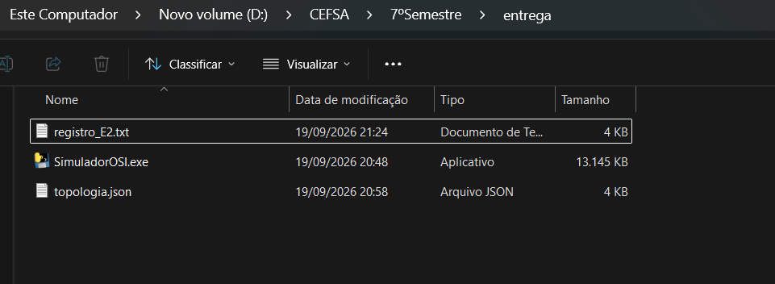
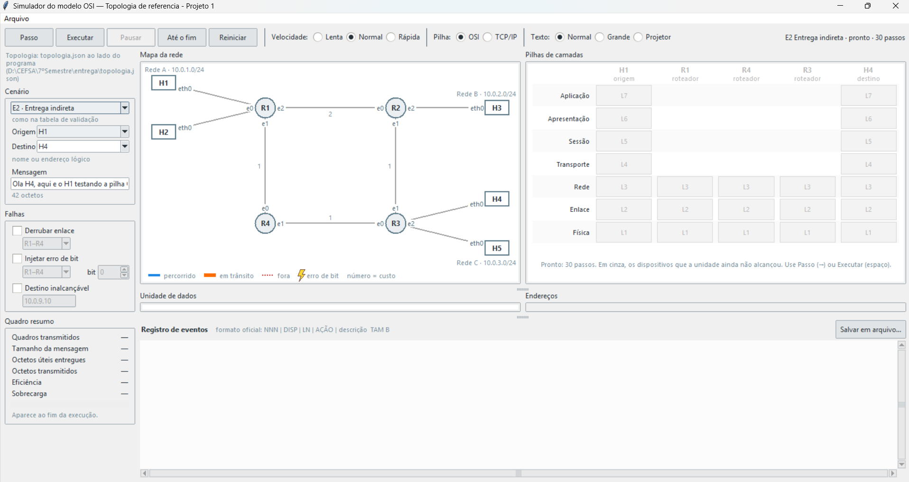
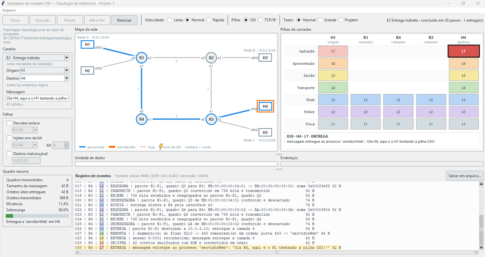
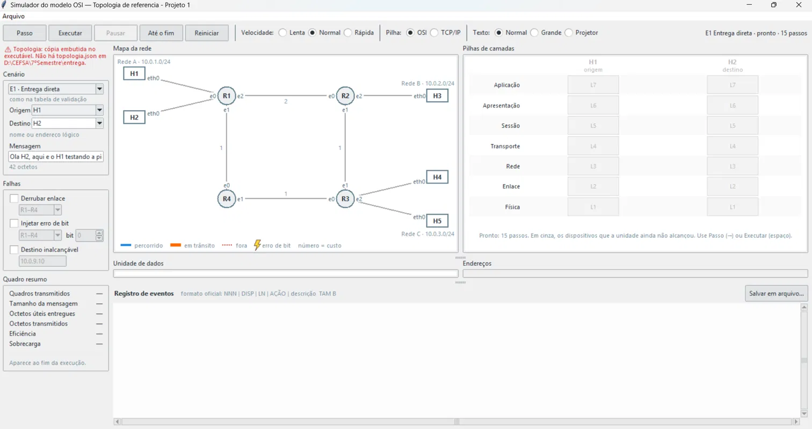

# Tutorial de Execução

## Simulador do Modelo OSI

Comunicação de Dados — Prof. Vinícius S. Borges — Semestre 2026/2 — Grupo 1

Eduardo Souza Urbanovicz Bastiani (082230018) · Ronaldo de Oliveira Santos (082230031) · João Vitor Maciel Nai (082230004)

---

Este documento explica como abrir o simulador e confirmar, em menos de um minuto, que ele funciona. Para aprender a operar cada função do programa, consulte o Tutorial de Uso.

---

## 1. Pré-requisitos

Windows. Nada mais.

Não é necessário instalar Python, nem bibliotecas, nem preparar ambiente. O programa é um executável independente e não usa a rede.

---

## 2. Abertura

Descompacte a entrega em uma pasta qualquer. A pasta contém o executável e o arquivo de topologia, lado a lado:

Dê **dois cliques em `SimuladorOSI.exe`**.

Na primeira execução o Windows pode exibir um aviso de proteção, por se tratar de um executável sem assinatura digital. Nesse caso, clique em **Mais informações** e depois em **Executar assim mesmo**.

---

## 3. A primeira tela

A janela abre com o cenário E1 carregado e pronto para executar:

A tela se divide em seis áreas.

**Barra superior.** Os cinco botões de execução — Passo, Executar, Pausar, Até o fim e Reiniciar — seguidos dos controles de Velocidade (Lenta, Normal, Rápida), de Pilha (OSI ou TCP/IP) e de Texto (Normal, Grande, Projetor). À direita fica o cenário em curso e o total de passos.

**Painel esquerdo.** A escolha do cenário, os campos de Origem, Destino e Mensagem, as três falhas que podem ser acionadas e, abaixo, o Quadro resumo com os números da execução.

**Mapa da rede**, ao centro. Os cinco computadores, os quatro roteadores, os enlaces com seus custos e os nomes das interfaces. A legenda embaixo explica as cores.

**Pilhas de camadas**, à direita. Uma coluna por dispositivo do percurso, com sete camadas nos computadores e três nos roteadores.

**Unidade de dados** e **Endereços**, ao centro e à direita. Aparecem a partir do primeiro passo.

**Registro de eventos**, na faixa inferior, com o botão Salvar em arquivo.

Acima de tudo há o menu **Arquivo**, com as opções de recarregar a topologia, gerar os registros dos sete cenários e sair.

---

## 4. Execução mínima

A sequência mais curta que confirma que o programa funciona:

1. Na lista **Cenário**, escolha **E2 · Entrega indireta**
2. Clique em **Até o fim**

---

## 5. Resultado esperado

Ao final da sequência acima, a tela deve mostrar:

- o caminho **H1 → R1 → R4 → R3 → H4** destacado em azul no mapa, com R2 em cinza, fora do percurso
- todas as camadas acesas nas pilhas de H1 e H4, e apenas as três primeiras nos roteadores
- no Quadro resumo: **4 quadros transmitidos, 42 B de mensagem, 368 B transmitidos, eficiência 11,4% e sobrecarga 88,6%**
- a mensagem final `Entregue a 'servidorWeb' em H4`
- no registro, 30 linhas, terminando em `030 | H4 | L7 | ENTREGA`

Conferindo esses números, o programa está funcionando corretamente na sua máquina.

---

## 6. Problemas conhecidos

### A janela abre com um aviso sobre a topologia

Se não houver um `topologia.json` ao lado do executável, o programa usa a cópia embutida e avisa no canto superior esquerdo. **O simulador funciona normalmente nesse estado** — a rede simulada é a de referência.

Para trocar a rede simulada, basta colocar um `topologia.json` ao lado do executável e reabrir o programa. O aviso desaparece e o caminho do arquivo em uso passa a ser exibido no mesmo lugar.

### A janela não abre

Confirme que o arquivo foi descompactado, e não executado de dentro do arquivo compactado. Alguns programas de compactação abrem o executável a partir de uma pasta temporária, onde ele não encontra o que precisa.

Se um antivírus tiver colocado o arquivo em quarentena, libere-o na lista de exclusões. Executáveis recém-gerados e sem assinatura digital acionam a detecção por heurística de alguns antivírus.

### A janela fecha sozinha

Não deve acontecer: o programa trata os erros e mantém a janela aberta, exibindo a mensagem. Se ocorrer, abra o Prompt de Comando, navegue até a pasta e execute `SimuladorOSI.exe` por ali — a mensagem de erro permanece visível no console.

### O arquivo de topologia está inválido

O programa abre mesmo assim e exibe o erro no lugar do mapa, indicando a linha e a coluna do problema ou o campo que falta. Corrija o arquivo e use **Arquivo → Recarregar topologia**, sem precisar fechar o programa.
