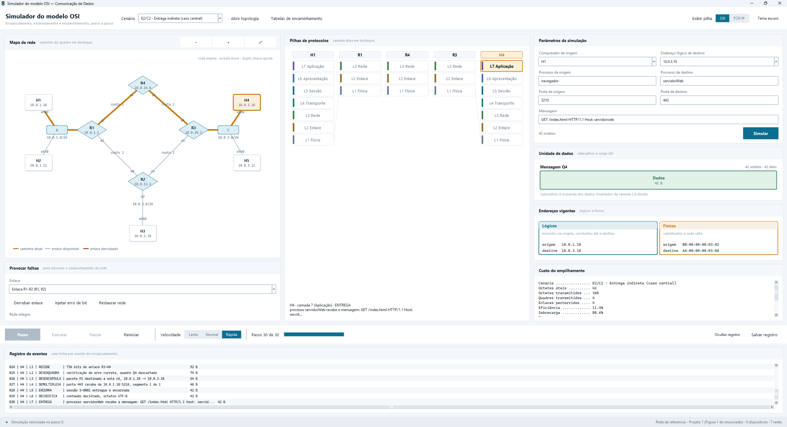

## 1. O caminho mais curto: o executável

Serve para quem só quer ver o simulador rodando, sem instalar Python.

1. Baixe `SimuladorOSI.exe` da pasta `dist/` do repositório (ou da seção
   *Releases*).
2. Dê um duplo clique no arquivo.
3. A janela abre em poucos segundos, já com o caso E2/C2 carregado.

Se aparecer a tela azul *"O Windows protegeu o computador"*, clique em **Mais
informações** e depois em **Executar assim mesmo**. O aviso aparece em qualquer
programa sem assinatura digital paga.

> 📸 **Captura de tela 1.**
> > 

---

## 2. Executando a partir do código-fonte

Funciona em Windows, macOS e Linux.

### 2.1 Verifique o Python

```bash
python --version
```

Precisa mostrar 3.10 ou mais. Se o comando não for reconhecido, instale o Python
em <https://www.python.org/downloads/> — **e marque a caixa "Add python.exe to
PATH"** durante a instalação, no Windows.

Em alguns sistemas o comando é `python3` em vez de `python`.

### 2.2 Obtenha o projeto

```bash
git clone git@github.com:Gabriieu/simulador-osi.git
cd simulador-osi
```

Ou baixe o ZIP pelo botão verde *Code → Download ZIP* e extraia.

### 2.3 Execute

```bash
python main.py
```

No Windows, também funciona o duplo clique em `SimuladorOSI.bat`.

Não há nada para instalar antes: o simulador usa apenas a biblioteca padrão do
Python.

---

## 3. Rodando os testes

Com pytest:

```bash
python -m pip install pytest
python -m pytest
```

Sem instalar nada (útil em laboratório sem internet ou sem permissão):

```bash
python ferramentas/rodar_testes.py
```

A saída esperada termina com:

```
91 aprovados, 0 falharam
```

Para rodar só um arquivo:

```bash
python -m pytest tests/test_cenarios.py
python ferramentas/rodar_testes.py test_cenarios.py
```

---

## 4. Gerando o executável

Precisa ser feito **no Windows** para produzir um `.exe` de Windows: o
PyInstaller empacota para o sistema em que é executado.

```bash
py -m pip install pyinstaller
py build_exe.py
```

O arquivo aparece em `dist/SimuladorOSI.exe`, com cerca de 10 MB, e roda em
qualquer Windows 10 ou 11 sem Python instalado.

O `topologia.json` vai embutido no executável, mas o programa procura primeiro
uma cópia ao lado do `.exe`. Para distribuir uma rede diferente, basta deixar um
`topologia.json` na mesma pasta.

---

## 5. Problemas comuns

| Mensagem ou sintoma | Causa | Solução |
|---|---|---|
| `'python' não é reconhecido` | Python fora do PATH | Reinstale marcando *Add python.exe to PATH*, ou use `py main.py` |
| `ModuleNotFoundError: No module named 'tkinter'` | Linux sem o pacote gráfico | `sudo apt install python3-tk` |
| `ModuleNotFoundError: No module named 'simulador'` | Executado de outra pasta | Entre na pasta do projeto antes: `cd simulador-osi` |
| A janela abre e fecha na hora | Erro durante a abertura | Execute pelo terminal com `python main.py` para ver a mensagem completa |
| `Arquivo de topologia não encontrado` | `topologia.json` movido ou renomeado | Devolva o arquivo à pasta do `main.py`, ou carregue outro pelo botão *Abrir topologia* |
| Texto cortado ou sobreposto | Janela pequena demais | Maximize a janela; o tamanho mínimo confortável é 1280 × 800 |
| `pytest: command not found` | pytest não instalado | Use `python ferramentas/rodar_testes.py` |
| O antivírus bloqueia o `.exe` | Executável sem assinatura | Libere o arquivo, ou execute pelo código-fonte |

---
