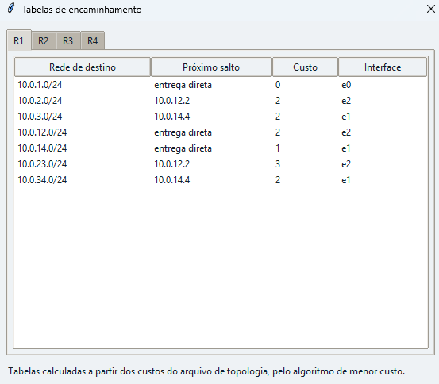

## 1. Primeira execução, em quatro passos

1. **Escolha o caso.** A lista no topo já vem em *E2/C2 — Entrega indireta*,
   que é o caso central. Ao trocar de caso, os parâmetros se ajustam sozinhos.
2. **Pressione *Passo*** Observe três coisas ao mesmo
   tempo: a camada que acende no centro, o bloco que aparece na unidade de dados
   à direita e a linha nova no registro embaixo.
3. **Repita.** Da camada 7 até a 1 na origem, atravessando cada roteador pelas
   camadas 1 → 2 → 3 → 2 → 1, e subindo da 1 até a 7 no destino.
4. **Pressione *Executar*** (ou `Enter`) para deixar rodar sozinho. *Pausar*
   (`Esc`) interrompe; *Reiniciar* (`Ctrl+R`) volta ao começo.

A velocidade tem três posições: Lenta, para acompanhar lendo o registro; Normal;
e Rápida, para chegar logo ao fim.

---

## 2. O que olhar em cada área

### 2.1 O mapa

O enlace por onde o quadro está passando fica destacado em âmbar. Os números
junto aos traços são os custos usados na decisão de rota. Um enlace derrubado
aparece tracejado, em vermelho, com um `X`.

### 2.2 As pilhas

Só a camada ativa fica colorida. Repare que os roteadores têm **três** camadas e
os computadores têm **sete**: essa é a diferença central do modelo, e ela está
desenhada, não apenas escrita.

Ao chegar a um roteador, o quadro sobe até a camada 3, a decisão de rota
acontece ali, e o quadro desce de novo. Ele nunca alcança a camada 4.

### 2.3 A unidade de dados

Os blocos seguem a ordem real: cabeçalhos à esquerda, dados no meio, finalizador
à direita. Cada bloco mostra o seu tamanho em octetos, e o total acompanha o
número que aparece no fim da linha do registro.

### 2.4 Os endereços

As duas colunas lado a lado são o ponto mais importante da tela: os endereços
lógicos **não mudam** do começo ao fim, e os físicos mudam a **cada enlace**.
Avance alguns passos olhando só para essas colunas.

### 2.5 O registro

Cinco campos: passo, dispositivo, camada, ação e descrição, com o tamanho da
unidade no fim. A linha correspondente ao passo atual fica destacada e a lista
rola sozinha. Linhas de descarte aparecem em vermelho.

`Ctrl+S` salva tudo em um arquivo de texto, com o quadro de eficiência no fim.

---

## 3. Roteiro dos sete casos

A ordem abaixo funciona bem como demonstração para a turma.

### E1/C1 — Entrega direta (H1 → H2)

Os dois computadores estão na mesma rede. Repare que **nenhum roteador aparece**
e que há um único quadro. A eficiência é de 45,7%. Guarde esse número.

### E2/C2 — Entrega indireta (H1 → H4)

O mesmo texto de antes, agora atravessando R1, R4 e R3. São quatro quadros, 368
octetos transmitidos e eficiência de **11,4%** — contra os 45,7% do caso
anterior. A mensagem é a mesma; o que mudou foi o preço de atravessar a rede.

Pare no passo 11 e leia a linha de roteamento em R1: `10.0.3.0/24 via R4, custo
2, interface e1`. Abra *Tabelas de encaminhamento*, na barra superior, e procure
essa mesma linha na tabela de R1.

> 📸 **Janela de tabelas de encaminhamento.**
> > 

### E3/C3 — Dois fluxos ao mesmo tempo

H1 e H2 enviam para H4 simultaneamente. No registro, acompanhe as portas de
origem 5210 e 5211: é por elas que a camada 4 de H4 separa as duas mensagens.
Procure as duas linhas `DEMULTIPLEXA`.

### E4/C4 — Queda de enlace

O enlace R1–R4 está fora. O caminho passa a ser R1 → R2 → R3, com custo total 3
em vez de 2. Compare a linha de roteamento de R1 com a do caso E2/C2: a tabela é
recalculada, não está escrita à mão.

Você pode reproduzir a falha em qualquer caso: escolha o enlace no painel
*Falhas*, à esquerda, e pressione *Derrubar*.

### E5/C5 — Destino inalcançável

O destino `10.0.9.10` não existe na rede. R1 não encontra rota e **descarta** o
pacote na camada 3. A linha vermelha do registro é a última: nada mais acontece
depois dela, e o resumo informa que a mensagem não foi entregue.

### E6/C6 — Erro de transmissão

Um bit é alterado no enlace R4–R3. Em R3, a camada 2 recalcula a verificação,
encontra divergência e descarta o quadro. O ponto a observar é o que **não**
aparece: não existe nenhuma linha de camada 3 em R3. O erro foi detectado antes
de a camada superior ser acionada.

### E7/C7 — Mensagem longa

Uma mensagem de 100 octetos ultrapassa o limite e é dividida em três segmentos,
com 40, 40 e 24 octetos de carga. Cada um percorre a rede por conta própria. No
destino, procure as linhas `AGUARDA` e, depois, `REMONTA`: a camada 5 só é
acionada quando a mensagem está completa outra vez.

---

## 4. Experimentos por conta própria

- **Mude a mensagem.** Escreva um texto seu no campo *Mensagem* e pressione
  *Simular*. Veja a eficiência subir conforme o texto cresce — a sobrecarga é
  fixa, então quanto maior a mensagem, melhor o aproveitamento.
- **Escolha outro destino.** Troque para `10.0.2.10` (H3) e veja o percurso
  mudar.
- **Derrube dois enlaces.** Tire R1–R4 e R1–R2 ao mesmo tempo: R1 fica sem saída
  e o pacote é descartado.
- **Alterne para TCP/IP.** O botão no topo agrupa as sete camadas nas quatro
  camadas do modelo TCP/IP, sem refazer a simulação.
- **Troque a rede inteira.** Edite `topologia.json`, ou carregue outro arquivo
  pelo botão *Abrir topologia*.

---

## 5. Atalhos de teclado

| Tecla | Ação |
|---|---|
| `Enter` | Executa automaticamente |
| `Esc` | Pausa |
| `Ctrl+R` | Reinicia |
| `Ctrl+S` | Salva o registro em arquivo |
