# Tutorial de Uso

## Simulador do Modelo OSI

Comunicação de Dados — Prof. Vinícius S. Borges — Semestre 2026/2 — Grupo 1

Eduardo Souza Urbanovicz Bastiani (082230018) · Ronaldo de Oliveira Santos (082230031) · João Vitor Maciel Nai (082230004)

---

Este documento percorre cada função do simulador. Para abrir o programa pela primeira vez, consulte antes o Tutorial de Execução.

---

## 1. Escolher o cenário

A lista **Cenário**, no alto do painel esquerdo, traz os sete cenários de validação:

| Cenário | O que exercita |
|---|---|
| E1 · Entrega direta | Entrega sem roteador, dentro da mesma rede |
| E2 · Entrega indireta | O caso central: três roteadores, quatro quadros |
| E3 · Demultiplexação | Dois fluxos simultâneos para o mesmo processo |
| E4 · Falha de enlace | Desvio quando um enlace sai de serviço |
| E5 · Destino inalcançável | Descarte por falta de rota |
| E6 · Erro de transmissão | Descarte por verificação de erro |
| E7 · Mensagem longa | Segmentação em três segmentos e remontagem |

Ao escolher um cenário, os campos de Origem, Destino, Mensagem e Falhas são preenchidos automaticamente, e a linha abaixo da lista informa **como na tabela de validação**.

Se qualquer campo for alterado depois, essa linha passa a informar **modificado: difere da tabela de validação**. Para voltar aos valores oficiais, basta escolher o cenário novamente na lista.

---

## 2. Definir origem, destino e mensagem

Abaixo da lista de cenários:

- **Origem** — o computador que envia. Escolha entre H1, H2, H3, H4 e H5.
- **Destino** — o computador que recebe. Aceita o nome (`H4`) ou o endereço lógico (`10.0.3.10`).
- **Mensagem** — o texto a transportar. O tamanho em octetos aparece logo abaixo do campo e se atualiza conforme você digita.

Os processos e as portas do caso central são `navegador` na porta 5210, na origem, e `servidorWeb` na porta 443, no destino.

Destinos inválidos são recusados com uma mensagem explicativa, sem interromper o programa. São recusados: campo vazio, endereço malformado, destino igual à origem, endereço fora da topologia e endereço de roteador — neste último caso, o programa informa que roteadores não possuem as camadas 4 a 7.

---

## 3. Trocar a rede simulada

O simulador lê a rede do arquivo `topologia.json`, que fica ao lado do executável. Trocar esse arquivo troca a rede, sem gerar um novo executável.

Para experimentar, abra o `topologia.json` em um editor de texto e altere o custo do enlace entre R1 e R4:

```json
{ "a": "R1:e1", "b": "R4:e0", "custo": 5, "rede": "enlace R1-R4" },
```

Salve o arquivo e use **Arquivo → Recarregar topologia**, ou feche e reabra o programa. Execute o cenário E2:

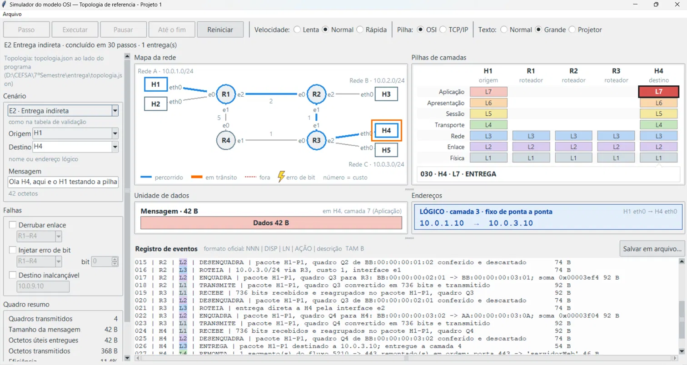

O caminho passa a ser **H1 → R1 → R2 → R3 → H4**, porque ir por R4 agora custa 6 e ir por R2 custa 3. O registro confirma a nova decisão: `10.0.3.0/24 via R2, custo 3, interface e2`.

Devolva o custo ao valor original, 1, antes de conferir os demais cenários.

---

## 4. Executar a simulação

Os cinco botões da barra superior:

| Botão | O que faz | Atalho |
|---|---|---|
| **Passo** | Avança um único evento | seta direita |
| **Executar** | Avança continuamente | espaço |
| **Pausar** | Interrompe a execução contínua | espaço |
| **Até o fim** | Vai direto ao último evento | — |
| **Reiniciar** | Volta ao início, mantendo a configuração | — |

A **Velocidade** controla o ritmo da execução contínua, em três níveis: Lenta, Normal e Rápida.

O controle **Texto** aumenta todas as fontes da interface em três níveis: Normal, Grande e Projetor. O nível Projetor é adequado para apresentação em sala.

---

## 5. Ler a tela

### O mapa da rede

O caminho percorrido aparece em azul e o enlace em trânsito em laranja. O dispositivo ativo recebe um anel. A legenda embaixo do mapa descreve também o enlace fora de serviço, em vermelho tracejado com um X, e o erro de bit, marcado por um raio.

### As pilhas de camadas

Uma coluna por dispositivo do percurso, da origem à esquerda ao destino à direita. Os dispositivos que a unidade ainda não alcançou aparecem em cinza claro.

A camada ativa fica destacada no instante em que processa a unidade. Abaixo das pilhas, uma faixa descreve o evento corrente.

Nos roteadores, a decisão de rota recebe destaque próprio:

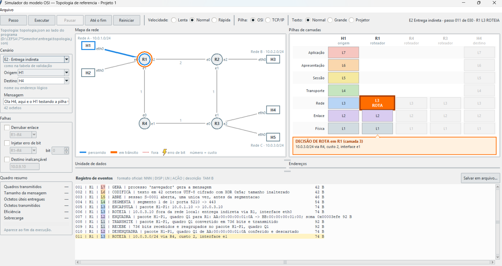

A camada 3 de R1 aparece em laranja com o rótulo ROTA, e a faixa abaixo informa a decisão: `10.0.3.0/24 via R4, custo 2, interface e1`.

### A unidade de dados

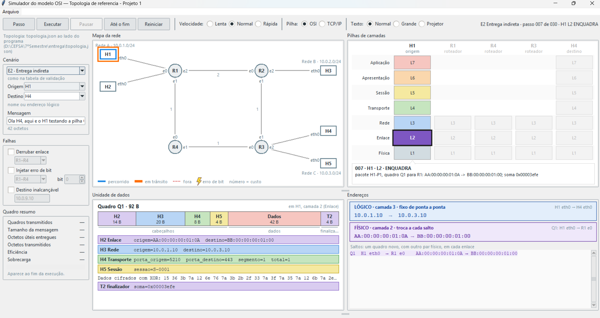

A unidade corrente é desenhada como uma sequência de blocos, com os cabeçalhos à esquerda, os dados ao centro e o finalizador da camada 2 à direita. A largura de cada bloco é proporcional ao seu tamanho em octetos.

O título informa o nome da unidade, o tamanho total e em que dispositivo e camada ela se encontra. Abaixo dos blocos, uma faixa por cabeçalho lista os campos que ele carrega.

### Os dois pares de endereços

No painel **Endereços**, à direita, os dois pares aparecem ao mesmo tempo, em cores distintas:

- **LÓGICO · camada 3 · fixo de ponta a ponta** — inserido na origem, permanece o mesmo até o destino
- **FÍSICO · camada 2 · troca a cada salto** — substituído em cada enlace

Abaixo, a lista de saltos registra o par físico usado em cada enlace, tornando visível que ele muda enquanto o par lógico não.

---

## 6. Alternar entre as pilhas

O controle **Pilha**, na barra superior, troca a exibição entre o modelo OSI de sete camadas e a pilha TCP/IP:

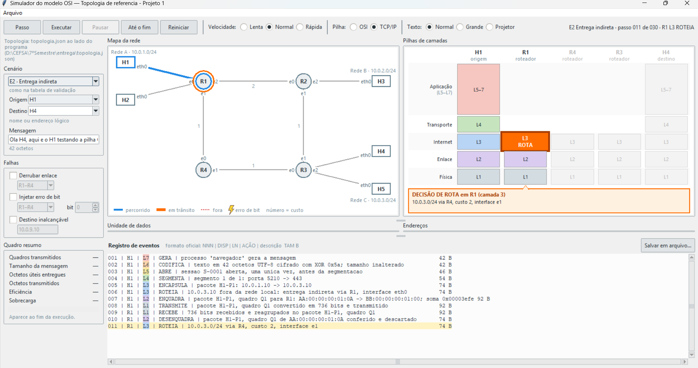

Na pilha TCP/IP, as camadas 5, 6 e 7 são agrupadas em uma única camada de Aplicação, e a camada 3 passa a ser chamada de Internet. A simulação subjacente não se altera: o registro de eventos continua identificando as camadas por L1 a L7.

---

## 7. Provocar falhas

As três falhas ficam no painel esquerdo e podem ser acionadas isoladamente ou junto de qualquer cenário.

### Derrubar um enlace

Marque **Derrubar enlace** e escolha o enlace na lista. O cenário E4 já vem com o enlace R1–R4 derrubado:

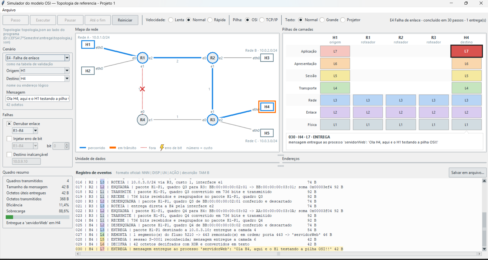

O enlace aparece tracejado em vermelho com um X, e o caminho passa por R2. O registro mostra a nova decisão em R1: `10.0.3.0/24 via R2, custo 3, interface e2`. O número de quadros e a eficiência não mudam — o que muda são os endereços físicos e o custo do caminho.

### Enviar para um destino inalcançável

Marque **Destino inalcançável** e informe um endereço fora da topologia. O cenário E5 já usa `10.0.9.10`:

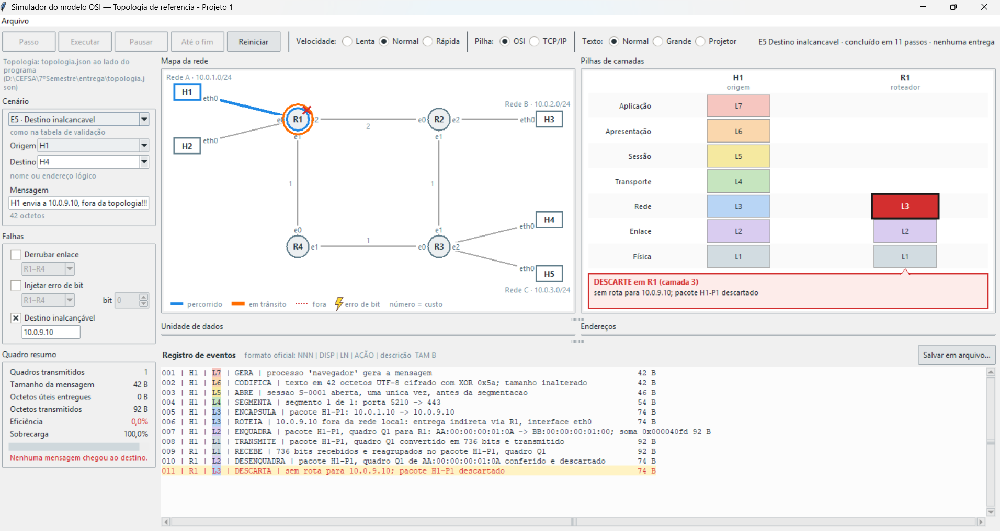

O quadro chega a R1, que não encontra rota e descarta o pacote na camada 3. O registro traz `011 | R1 | L3 | DESCARTA | sem rota para 10.0.9.10`. Apenas H1 e R1 aparecem nas pilhas, e a eficiência é 0.

### Injetar um erro de bit

Marque **Injetar erro de bit**, escolha o enlace e o número do bit a inverter. O cenário E6 já injeta o erro no enlace R4–R3:

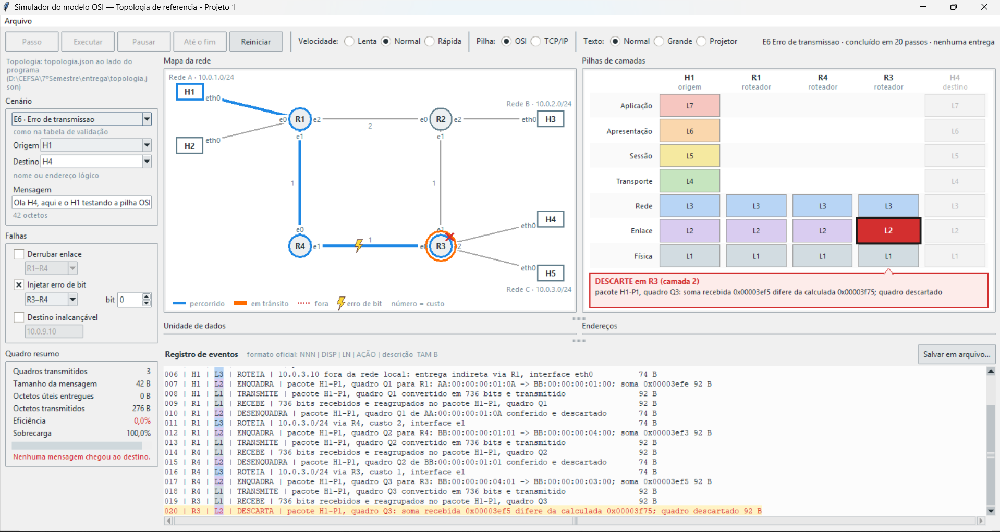

Um raio marca o enlace afetado no mapa. A camada 2 de R3 recalcula a verificação de erro, encontra divergência e descarta o quadro. Observe que **nenhuma camada superior de R3 é acionada**: o registro termina em `020 | R3 | L2 | DESCARTA` e não contém nenhuma linha de camada 3 em R3.

---

## 8. Dois fluxos simultâneos e mensagem longa

Dois cenários exercitam a camada 4 de maneiras que os demais não alcançam.

### E3 · Demultiplexação

H1 e H2 enviam ao mesmo tempo para o processo `servidorWeb` de H4, com portas de origem distintas:

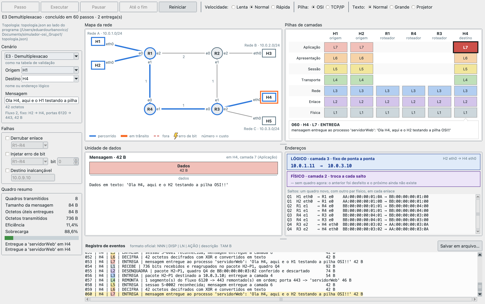

As duas origens aparecem nas pilhas de camadas, e o painel esquerdo informa o segundo fluxo abaixo da mensagem. A camada 4 de H4 separa os fluxos pelo par de portas e entrega cada um à sua sessão, S-0001 e S-0002, conforme indica o Quadro resumo com duas entregas.

A numeração dos quadros reinicia a cada mensagem, de modo que Q1 a Q4 aparecem duas vezes na lista de saltos, uma vez por fluxo, com endereços físicos de origem distintos no primeiro enlace.

### E7 · Mensagem longa

H1 envia uma mensagem de 100 octetos, acima do limiar de segmentação:

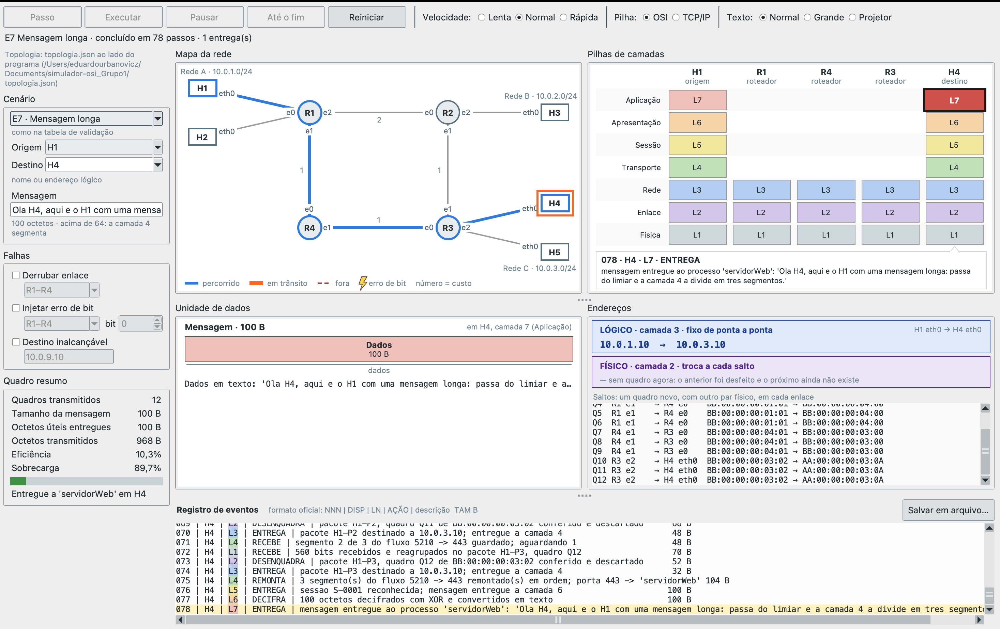

O campo Mensagem informa `100 octetos · acima de 64: a camada 4 segmenta`. A camada 5 acrescenta seu cabeçalho de 4 octetos e a camada 4 recebe 104, que divide em três segmentos de 40, 40 e 24 octetos.

Cada segmento percorre a rede por conta própria, totalizando doze quadros, Q1 a Q12. A camada 4 de H4 guarda os segmentos conforme chegam e só entrega à camada 5 depois de remontar os três na ordem correta, como registra a linha `REMONTA | 3 segmento(s) do fluxo 5210 -> 443 remontado(s) em ordem`.

---

## 9. Salvar o registro de eventos

Clique em **Salvar em arquivo...**, no canto direito da faixa do registro:

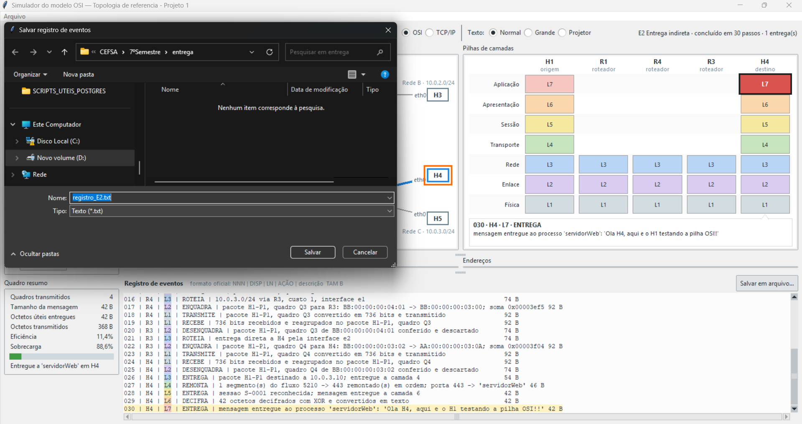

O nome sugerido segue o cenário em curso — `registro_E2.txt` — e a pasta sugerida é a do próprio executável.

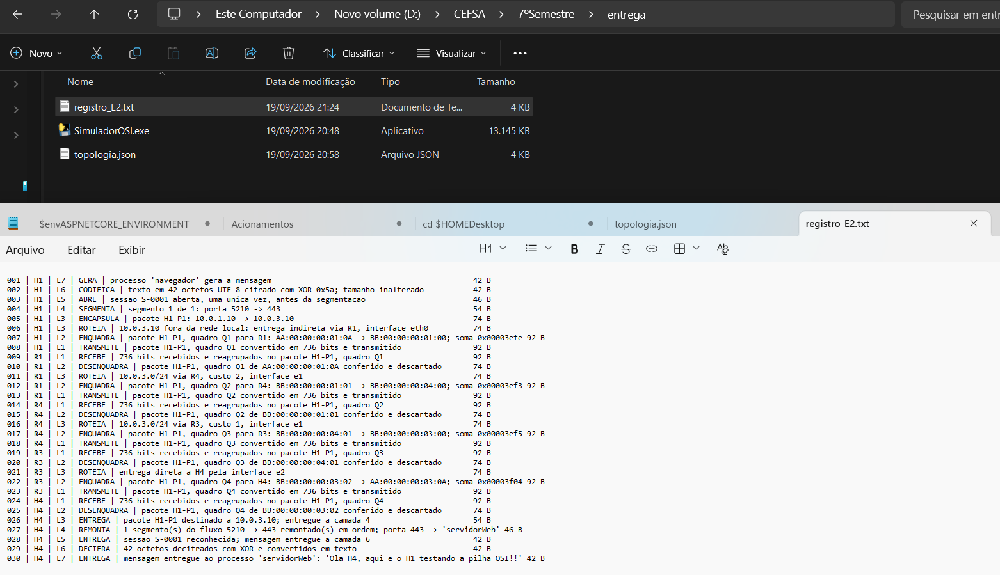

O arquivo gravado contém as linhas no formato oficial, idênticas às exibidas na tela.

Para gerar de uma vez os registros dos sete cenários, use **Arquivo → Gerar registros dos sete cenários**. Os arquivos são criados na pasta `registros/`, ao lado do programa.

---

## 10. Conferir um resultado conhecido

Para confirmar que o simulador produz na sua máquina os valores da especificação, reproduza o cenário E2:

1. Na lista **Cenário**, escolha **E2 · Entrega indireta**
2. Clique em **Reiniciar**
3. Clique em **Passo** sete vezes


No passo 007, a unidade é o quadro Q1, com 92 octetos distribuídos em H2 (14 B), H3 (20 B), H4 (8 B), H5 (4 B), Dados (42 B) e T2 (4 B). O par lógico é `10.0.1.10 → 10.0.3.10` e o par físico `AA:00:00:00:01:0A → BB:00:00:00:01:00`.

4. Clique em **Passo** mais quatro vezes

No passo 011, R1 decide a rota. A linha do registro deve ser exatamente:

```
011 | R1 | L3 | ROTEIA | 10.0.3.0/24 via R4, custo 2, interface e1
```

5. Clique em **Até o fim**


O Quadro resumo deve apresentar:

| Campo | Valor esperado |
|---|---|
| Quadros transmitidos | 4 |
| Tamanho da mensagem | 42 B |
| Octetos úteis entregues | 42 B |
| Octetos transmitidos | 368 B |
| Eficiência | 11,4% |
| Sobrecarga | 88,6% |

Os quatro quadros do percurso, com seus pares de endereços físicos:

| Enlace | Quadro | Físico de origem | Físico de destino |
|---|---|---|---|
| H1–R1 | Q1 | AA:00:00:00:01:0A | BB:00:00:00:01:00 |
| R1–R4 | Q2 | BB:00:00:00:01:01 | BB:00:00:00:04:00 |
| R4–R3 | Q3 | BB:00:00:00:04:01 | BB:00:00:00:03:00 |
| R3–H4 | Q4 | BB:00:00:00:03:02 | AA:00:00:00:03:0A |

O par lógico `10.0.1.10 → 10.0.3.10` é o mesmo nos quatro quadros.

Conferindo esses valores, o simulador reproduz a tabela de validação da especificação.

---

## Anexo: os sete cenários e seus valores

| Cenário | Passos | Quadros | Octetos | Eficiência |
|---|---|---|---|---|
| E1 Entrega direta | 15 | 1 | 92 | 45,7% |
| E2 Entrega indireta | 30 | 4 | 368 | 11,4% |
| E3 Demultiplexação | 60 | 8 | 736 | 11,4% |
| E4 Falha de enlace | 30 | 4 | 368 | 11,4% |
| E5 Destino inalcançável | 11 | 1 | 92 | 0 |
| E6 Erro de transmissão | 20 | 3 | 276 | 0 |
| E7 Mensagem longa | 78 | 12 | 968 | 10,3% |

A comparação entre E1 e E2 é a que o projeto existe para tornar visível: a mesma mensagem de 42 octetos, transportada por um enlace ou por quatro, tem a eficiência caindo de 45,7% para 11,4% sem que um único octeto de dado a mais tenha sido enviado.
